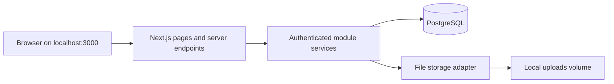

# Architecture and domain model proposal

Status: proposed for review, 2026-09-18. This is not a database migration or an approved change to product policy.

## Application boundary

One Next.js/TypeScript modular monolith serves pages and server endpoints. PostgreSQL holds authoritative data, using Prisma migrations and transactions. Module services own validation, permission checks, approval checks, and writes. Page visibility is only a usability feature: every read, mutation, attachment download, and export enforces server-side authorization.

Use one repository and one package. Avoid extra infrastructure for the stated 20 users / fewer than 10 concurrent users. A local filesystem storage adapter is sufficient initially, with object storage possible later without changing business records.



## Foundation entities — Phase 1

| Entity | Important fields / relationships | Integrity and ownership |
|---|---|---|
| User | ID, normalized unique username, display name, department ID, password hash, active flag, auth version, timestamps | Administrator owns lifecycle. Deactivation and credential reset revoke sessions. Never hard-delete referenced actors. |
| Department | ID, code, name, active flag | Controlled list, not free-text department aliases. |
| Session | User ID, token hash, created/expires/revoked timestamps, authentication version | Never store raw session tokens or passwords in audit records. Enforce expiration and active user status per request. |
| Role / Permission / RolePermission | Role code/name; stable module/action permission keys; explicit grants | Role names and employees do not appear in authorization conditionals. Unknown permission means deny. |
| UserRoleAssignment | User ID, role ID, scope mode, assignment validity | A scoped permission is evaluated through the assignment that grants it. Multiple assignments must not mix unrelated scopes. |
| AssignmentScope | Assignment ID, brand ID, market ID | Exact allowed combinations; all-scope must be explicit. Never interpret an empty restricted scope as global access. |
| Brand / Market / BrandMarket | Codes/names, active flag; valid combinations | Minimal scope reference tables in Phase 1; business master editing is Phase 2. RAMA/India and Phoenix/UK/USA/France are reference mappings, not a hard-coded restriction. |
| ApprovalPolicyVersion / ApprovalStage | Action key, version, draft/active state, typed conditions, ordered stages, configured role/permission, effective dates, self-approval flag | Configuration only initially; no invented thresholds or automatic approval from role labels. Published versions are preserved. |
| ApprovalRequest / ApprovalDecision | Policy version ID, subject type/ID/version, requester, stage, actor, decision, reason, timestamp | Introduced with the first approval-bearing workflow; bind approval to a specific subject revision. Later edits invalidate approval. |
| AuditEvent | Actor ID or anonymous security actor, action, subject, timestamp, request ID, reason, safe before/after fields | Append-only for runtime DB role; business mutation and success audit commit together. Failed/security attempts are recorded separately. |
| SystemSetting | Typed key/value, version, updated-by ID | Settings changes validated and audited. Store secrets outside this table. |

Administrative privileges must not imply business approval. Phase 1 uses only proposed grants explicitly accepted in [P1-02](ONBOARDING_REVIEW.md). Approval levels are workflow stages, not a numeric shortcut that automatically gives higher-ranked users every lower permission.

For policy changes and sensitive writes, check authorization against current state within the transaction. Use subject versions or row locks to prevent a permission/record change racing with an approval or posting. Cache public/static UI freely; do not share user-scoped responses across users.

## Later operational entities

| Module | Proposed entities and relationships | Key controls / unresolved decisions |
|---|---|---|
| Masters | Product, SKU, ProductCategory, UnitOfMeasure, Location, Component, SKUComponent, PackSpecification, ReasonCode, ComplaintCategory; optional Supplier | Unique controlled codes, deactivate instead of breaking history. Version component and pack specifications. Precision, BOM and compatibility await confirmation. |
| Production | ProductionPlan, WorkOrder, ProductionEntry, ProductionEntryLine, ProductionCorrection, ManufacturingBatch | Plan and actual separate. Batch manufacturing date supports complaint classification. Inner and outer components remain independent lines. Posted actuals corrected by linked reversal/correction records. |
| Inventory | InventoryTransaction, InventoryLeg, StockBucket, Adjustment, Reconciliation, ReconciliationLine | StockBucket identifies SKU/batch/location and physical/quality/packaging state. Sum signed ledger legs for balances; no editable authoritative balance. Transfer legs conserve quantity. Approval separate from posting status. |
| QC | Inspection, InspectionDisposition, QualityHold, NCR, ReinspectionLink | Disposition quantities per batch/bucket; pass, hold, reject and rework may split a batch. Define conservation before implementation. Only explicitly authorized release changes held quantities. |
| Packaging | PackagingRun, PackagingLine, PackagingCheck, PackagingException | Link batch, market/brand pack specification, consumed/packed/damaged quantities and evidence. Normal completion requires QC release. |
| Dispatch | DispatchOrder, DispatchOrderLine, Allocation, AllocationEvent, Picklist, DispatchRelease, Shipment, ShipmentLine | Demand creates no stock movement. Allocation reserves without reducing physical on-hand. Shipment posts one stock issue and consumes reservation. Partial/cancel/release policy awaits confirmation. |
| Complaints | Complaint, ComplaintEvidence, ComplaintBatchLink, ComplaintClassificationHistory | Ticket uniqueness scope to be agreed; ticket always required. Preserve supplied batch text and verified mapping separately. Customer Support cannot change QC conclusions. |
| CAPA | CAPA, CAPASourceLink, CAPAAction, CAPAVerification, CAPAExposure, CAPAClosure | Sources may include complaint, NCR, batch or internal finding. Effective date/batch, failure mode and exposure precede effectiveness conclusions. Closure requires evidence and configured approval. |
| Shared imports | ImportJob, ImportRow, ImportError, ImportCommit | Template version, file hash/storage key, actor/scope, normalized rows, row count, original row numbers, preview version, status, idempotency key and linked output IDs. |
| Shared attachments | Attachment plus typed module link tables | Metadata in DB, bytes behind storage adapter; parent authorization on reads. File/row/size/retention limits decided before upload features. |
| Reports | Read models / SQL views over canonical records | No separate manually entered dashboard figures. Permission and scope filters apply before aggregation and export. |

Use foreign keys and unique constraints for concrete relationships. Polymorphic audit subjects retain snapshots if a draft disappears; business sources use typed join tables rather than unchecked arbitrary IDs. Store business dates as dates, event timestamps as UTC instants, and exact quantities in suitable numeric types after unit/precision decisions. Financial accounting is outside this model.

## Inventory, QC and dispatch integrity

- Represent SFG/FG, quality disposition, and packaging state independently; reservation is its own quantity relationship. One generic enum cannot represent all combinations.
- Current on-hand is the sum of posted inventory legs. Usable quantity additionally requires the permitted quality/packaging state; available-to-allocate subtracts active reservations only once.
- A state transfer moves quantity out of one bucket and into another atomically. Reservations have append-only events; they must not appear as physical issues.
- Lock the relevant stock buckets in a consistent order, recompute available quantities, and apply quantity constraints within one PostgreSQL transaction. Concurrent allocations must not oversubscribe.
- A shipment verifies current QC status, packaging, release, reservation and quantity again before posting. A later hold must block already allocated stock from shipping until resolved.
- Correction/reversal references its original transaction and preserves attribution. No routine endpoint edits/deletes posted legs.
- Production receipt, QC disposition and packaging transitions use source-linked unique posting keys so retrying a request cannot duplicate stock.

## Shared single-entry and import path

Manual forms and validated import rows invoke the same module service. Parsing never writes operational tables. Validation produces stable row numbers, errors and a preview. Confirmation rechecks current authorization, references, quantities and policy; stale preview cannot override current state. Output transactions, row outcomes and audit entries commit atomically with an idempotency key.

The proposed default is whole-file atomic commit with zero errors, pending R-05 approval. If valid-row acceptance is chosen later, its explicit selection, partial-result reporting, retry key and rollback boundary must be specified first. A network retry must never repost accepted rows. File bytes do not share a SQL transaction: stage uploads and publish references only after validation, with orphan cleanup for failed commits.

## Repository structure

Create only Phase 1 directories now; the module names below describe the future boundaries.

```text
src/
  app/
    (auth)/login/
    (workspace)/
      layout.tsx
      page.tsx
      users/
      roles/
      settings/approval-rules/
      audit/
    api/health/live/
    api/health/ready/
  components/             # Forms, accessible tables, status badges, navigation
  modules/
    identity/             # User lifecycle, sessions, validation, module service
    authorization/        # Explicit permission + scope checks
    approvals/            # Policy definitions; workflow execution added later
    audit/                # Redaction and append-only event service
    masters/              # Phase 2
    production/           # Phase 3
    inventory/            # Phase 4
    quality/              # Phase 5
    packaging/            # Phase 6
    dispatch/             # Phase 7
    complaints/           # Phase 8
    capa/                 # Phase 9
    reports/              # Phase 10
  server/
    db/
    storage/
    config/
  shared/validation/
prisma/
  schema.prisma
  migrations/
scripts/                  # Bootstrap admin, backup and restore
tests/
  unit/
  integration/            # Real PostgreSQL, isolated test database
  e2e/
docs/                     # Existing source documents preserved
Dockerfile
compose.yaml
.dockerignore
.env.example
package.json
package-lock.json
```

Select a maintained compatible authentication implementation during Phase 1 and verify its current documentation; do not invent password or cryptographic primitives. Pin resolved package versions and commit the lockfile. Preserve existing `AGENTS.md` during scaffolding.
